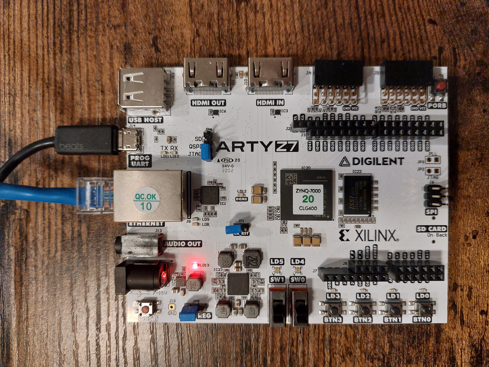
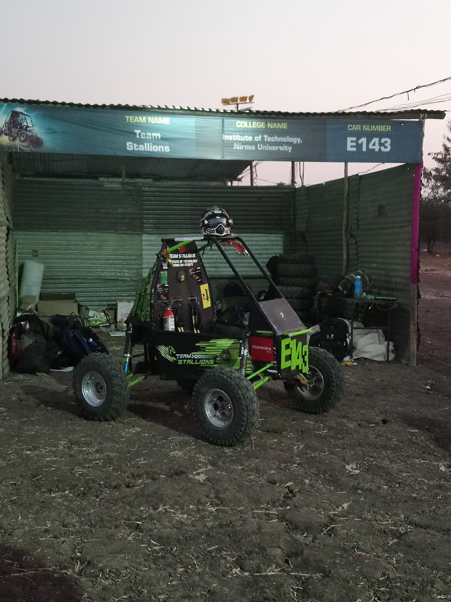

Welcome to my Github page! I recently graduated with a Master's degree in Electrical Engineering from Arizona State University, in May 2024. I am interested in Computer Engineering, Controls and Digital Signal Processing. I like to work at the intersection of hardware and software systems, and develop computing systems for DSP, Control, sensing and robotic systems.
### [<< GitHub >>](https://github.com/ARZ3N)

## Contents
- [Research Activities](#research-activities)
- [Some of My Projects](#some-of-my-projects)
- [Publications](#publications)
- [SAE Student Automobile Club](#sae-student-automobile-club)

## Research Activities
As a graduate student, I was part of the **DSP Technology Development Lab**, at ASU's School of Earth & Space Exploration, where I contribute to projects involving FPGA based RADAR spectroscopy instruments for Earth and Space based remote sensing. We write VHDL/Verilog code to implement various DSP algorithms on FPGAs and also develop embedded firmware for programming ARM devices for Data readout and communication. 
### My work in the lab involved:
#### High Speed Data Readout Interface using Xilinx Zynq-7000 SoC using Gigabit Ethernet
#### Implementing Fast Memory read/write access for Polyphase Filter Bank based DSP algorithm.

## Some of My Projects
- ### Linear Optimal Control of Two-Wheel Self Balancing Robot
  
  Developed a decoupled Linear State Space system model for a Two-Wheel Self-Balancing Robot's dynamics in MATLAB. Then, designed a full-state feedback LQR controller with a Kalman Filter Observer, with the algorithm and simulation done in MATLAB. 
  Also explored an algorithm to generate the Q and R matrices based on the idea that certain pair of states variables would inherently behave inversely to the other state. Conic function based quadratic equations were used to map the Q matrix elements associated with respective state variables. This led to a easier, and more intuitive method for constructing LQR weight matrices, while thinking in terms of geometry rather than the usual trial and error. This was successful in reducing settling time by 45% and overshoot by 36%. Worked on designing a virtual test simulation of the robot using the Mujoco simulator.

- ### Estimating Airfoil Aerodynamic Lift Coefficient Using Neural Networks
  _Motivation_: Usually, to calculate lift coefficient of a given airfoil, software (such as XFOIL) use iterative methods to converge to a value by considering differential equations describing air flow around an object. But quite often, for some airfoil geometries, the software is unable to converge at a 'good' value or does not converge at all.
    Neural Networks being excellent function approximators, an idea was put to test- to make a neural network learn about the math and physics behind airflow around a 2D geometry, ultimately predicting the lift coefficient of the given airfoil.
  - Designed a deep learning model with 2x Convolution layers with RELU activation function, an Input Layer, 1x fully dense layer and an output layer.
  - Airfoil shapes (2D crossectional shape) is considered as 31 pairs of 2D cartesian cordinates forming the boundary of the airfoil. Other details involve flight condition with a viscuous flow Reynold's number of 1.3e7 and subsonic flight conditions of Mach 0.3. Angle fo attack would vary from -2 deg to 10 deg.
  - Used UIUC's Airfoil Datasite to access 1621 airfoil shape data. Created C and Shell scripts to standardize coordinate listing format.
  - Used XFOIL solver for gathering lift coefficient data for available. Created C and Powershell scripts to parse through files and check convergence failure in data files associated with all 1621 airfoil shapes. XFOIL would often fail to converge for certain airfoil shapes with the given flight conditions.
  - Trained the neural net for 1600 epochs. Deep learning model built and trained with Tensorflow-Python.
  - Achieved lift coefficient estimation accuracy of 98.63% and the neural network is also able to estimate lift coefficients of arbitrary airfoil shapes (completely new shapes).

  Project Repository: [airfoil-nn-GitHub](https://github.com/ARZ3N/Airfoil_NN)
  

- ### **_Human Arm Motion Capture Using IMU Sensors_**
  - _Motivation_: To develop a computationally cheaper alternative to computer vision based human body motion tracking technology, by utilising IMU sensors. Develop something which can also be used as a means to further advancements in prosthesis control and human-computer interaction.
  - Methodology:
    - Sensor interface and Signal processing:
     + Sensor used: Invensense MPU 9250 Accelerometer + Gyroscope + Magnetometer
     + Implemented FIR/Moving Average Filter for removing noise due to sudden shifts in motion over a short period of time.
     + I2C communication channel between sensor and microcontroller.
    - Used a quaternion based sensor fusion technique to estimate orientation of each segment individually. Rotate each segment’s quaternion using the rotation quaternion calculated for the previous segment. (Rotation quaternion calculated from upper arm sensor data used to reposition coordinate system of forearm).
    - Develop necessary mounts and embedded electronics to place and interface sensors on the arm.
    - Develop embedded firmware for Arm cortex-m4 (MK66FX1M0) device for sensor interface and communication. Develop a python based 3D render of the human arm for visualization.

     

      Development Source Code: [imu-arm-motion-capture--GitHub](https://github.com/ARZ3N/imu-arm-motion-capture)
      
      Conference Publication Link: [DOI: https://doi.org/10.1007/978-981-19-4975-3_63](https://doi.org/10.1007/978-981-19-4975-3_63)
      
- ### **_Development of a custom Command Line Interface_**
  - _Motivation_: To understand the internal working of a command-line interface, with primary emphasis on OS-based shells, like BASH, and how these make use of processes to execute commands.
  - Developed a simple BASH-like CLI capable of invoking some custom commands and interact with OS functions.
  - Learned to use the POSIX "pthreads.h" library and how to create processes and child-process management.
  - Developed understanding of the shell program structures including input parsing, validation, execution blocks, etc.

      Project Source: [SeaShell -- GitHub](https://github.com/ARZ3N/SeaShell)
      
## Publications

- ### Bhattacharjee, A., Bhatt, C. (2021). Human Arm Motion Capture Using IMU Sensors. 1st International Conference on Smart Ennery and Advancements in Power Technology (Track- Biomedical Instrumentation and Applied Sciences), National Institute of Technology, Jamshedpur. Springer Lecture Notes in Electrical Engineering.
Conference Publication Link: [DOI: https://doi.org/10.1007/978-981-19-4975-3_63](https://doi.org/10.1007/978-981-19-4975-3_63)

## SAE Student Automobile Club
- ### National Winners, SAE BAJA - 2019, INDIA
Nirma University Student Team

##### Thank You!

